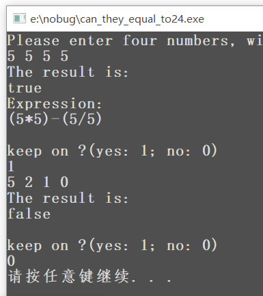

## 《程序设计进阶与实践》实验报告

姓名：李宁			学号：PB21111715			班级：计科三班			日期：2022 年 4 月 13 日

**实验名称**：24点问题的求解

**代码语言**：C语言

**实验环境**：CPU：Core i7-11800H 2.30GHz	内存：32GB	操作系统：Windows10	软件平台：Visual Studio Code

### 一、问题分析与求解思路

#### 1.问题描述：

对于给定的四个整数（可能相等，均不大于20），判断是否存在通过加减乘除四则运算（要求每个正整数使用且仅使用一次），得到24

#### 2.思路分析：

**判断过程：**

只有四个整数，且均不大于20，所以直接穷举所有可能的表达式即可，使用递归回溯的方法，主要步骤如下：

1. 将四个整数以浮点数形式放入数组中
2. 从数组中任取两个数
3. 两个数之间穷举四则运算，中间结果存入第一个数的位置，第二个数标记为使用过
4. 重复2-3三次后得到最终结果
5. 判断最终结果是否等于24
6. 若等于，退出；若不等于，向上回溯，继续递归

**输出表达式：**

在判断过程中记录表达式的信息，再通过输出函数解析信息输出表达式，输出函数的具体原理将在下面说明。

### 二、核心代码说明

**void calcu() //判断是否能够计算出24，并记录表达式数据:**

这个函数用于判断，普通的递归回溯方法，人人都会写，下面主要分析表达式信息的记录与解析。

#### 信息记录：

就是把每一层函数被选中的数记录下来，并记录是否是上一层的运算结果（这将影响表达式的形式），把每一层选择的运算符号记录下来，进入输出函数解析即可确定表达式的形式，并按形式输出即可。

```c
//记录所选数字的信息
x = num[i];		//x,y为选择出的两个数
y = num[j];
if (i == record)	//record记录了上一层的中间结果的所在位置
	mark[count] = 1;	//标记计算中用到了中间结果
figure[count++] = x;	//记录被选出的数字
if (j == record)
	mark[count] = 1;
figure[count++] = y;
```

```c
//记录运算符号的信息
case 0:
	out = x + y;	sign[run] = '+';	break;
case 1:
	out = x - y;	sign[run] = '-';	break;
case 2:
	out = x * y;	sign[run] = '*';	break;
case 3:
	if (y != 0) {
		out = x / y;
		sign[run] = '/';
	}
	else	error++;//考虑分母不能为0
```

#### 表达式输出：

表达式形式主要由以下几种：

> %d%c(%d%c(%d%c%d))
>
> (%d%c(%d%c%d))%c%d
>
> %d%c((%d%c%d)%c%d)
>
> ((%d%c%d)%c%d)%c%d
>
> (%d%c%d)%c(%d%c%d)

分类讨论即可，依据第三层函数所选的两个数的情况分类讨论，但需要加上一个补丁才能修正bug，bug在于record只记录了上一层函数中间过程所在位置，第三层如果使用了第一层的中间结果，mark数组是记录不出来的，但此种情况可以通过第二层所选的数的情况进行修正，如果第二层的两个数都不是第一层的中间结果，那么第三层的两个数一定都是中间结果。

输出函数的代码如下：

```c
void print_solution() //分析表达式数据，输出表达式
{
	int debug;
	printf("Expression:\n");
	if (mark[3] == 0 && mark[2] == 0)	
	//修正bug的补丁,如果第3,4个数没有用到之前的运算结果，则第5,6个一定全用到
	{
		if (mark[5] == 1)
			debug = 5;	//用于判断第一次中间结果与第二次中间结果的前后
		else if (mark[4] == 1)
			debug = 4;
		mark[4] = 1;
		mark[5] = 1;
	}
	//下面就表达式形式按三种情况讨论
	if (mark[5] == 1 && mark[4] == 0)
	{
		printf("%d%c", (int)figure[4], sign[2]);
		if (mark[3] == 1)
		{
			printf("(%d%c(%d%c%d))", (int)figure[2], sign[1], (int)figure[0], sign[0], (int)figure[1]);
		}
		else if (mark[2] == 1)
		{
			printf("((%d%c%d)%c%d)", (int)figure[0], sign[0], (int)figure[1], sign[1], (int)figure[3]);
		}
	}
	else if (mark[5] == 0 && mark[4] == 1)
	{
		if (mark[3] == 1)
		{
			printf("(%d%c(%d%c%d))", (int)figure[2], sign[1], (int)figure[0], sign[0], (int)figure[1]);
		}
		else if (mark[2] == 1)
		{
			printf("((%d%c%d)%c%d)", (int)figure[0], sign[0], (int)figure[1], sign[1], (int)figure[3]);
		}
		printf("%c%d", sign[2], (int)figure[5]);
	}
	else
	{
		if (debug == 5)
		{
			printf("(%d%c%d)%c(%d%c%d)", (int)figure[0], sign[0], (int)figure[1], sign[2], (int)figure[2], sign[1], (int)figure[3]);
		}
		else if(debug == 4)
		{
			printf("(%d%c%d)%c(%d%c%d)", (int)figure[2], sign[1], (int)figure[3], sign[2], (int)figure[0], sign[0], (int)figure[1]);
		}
	}
	printf("\n");
}
```

###  三、测试，运行与分析

#### 1.测试运行情况：

从网上挑选了一些比较经典的测试用例，结果如下：

> input：2 3 12 12
>output：true	12-((2-3)*12)

> input：1 5 5 5
>output：true	(5-(1/5))*5

> input：1 4 4 7
>output：true	((1\*4)*7)-4

> input：3 3 8 8
> output：true	8/(3-(8/3))

> input：5 5 5 5
> output：true	(5*5)-(5/5)

> input：5 2 1 0
>output：false

经验证结果均正确，所以程序大概率是正确的。

test程序得出能计算出24点的总数为108099（包含顺序上的重复），经查询结果正确。

附图：

 

#### 2.分析与体会：

完成这个题目的过程中主要有三点值得注意：

1. 回溯时状态的还原
2. 表达式信息记录时要考虑周全
3. 不能直接输出表达式时，先记录信息，在解析处理后输出的想法

总体来说这次实验还是要比前两次简单一些的，至少从花费的时间上来看是如此，也不排除是我debug能力变强了(doge

### 四、总结

通过这次实验，我主要的收获：

- 更加熟练地掌握递归回溯的策略
- 初步掌握了输出运算表达式的方法（虽然是自己造的轮子）

### 五、附件

- **can_they_equal_to24.c**（源代码中有交互方式的说明）
- **test.c**（测试能计算出24的总数，包含顺序上的重复）
