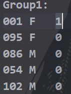
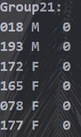

## 《程序设计进阶与实践》实验报告

姓名：李宁			学号：PB21111715			班级：计科三班			日期：2022 年 5 月 11 日

**实验名称**：随机分组程序

**代码语言**：C语言

**负责模块**：程序设计与实现

**实验环境**：CPU：Core i7-11800H 2.30GHz	内存：32GB	操作系统：Windows10	软件平台：Visual Studio Code

### 一、问题分析与求解思路

#### 1.问题描述：

给定具有n（30<=n<=200)个学生的班级，男女比接近1:1, 大佬人数大约10%，读入含有班级同学信息的txt文件，包括学号（3位数），性别，是否是大佬。根据得到的信息进行随机分组。

分组要求如下：

- 每组人数为5-6人

- 每组都含有男生和女生，且为使组员不孤单，男生至少两人，女生至少两人。

- 为公平起见，大佬数目应尽量分配均匀
- 若组内没有大佬，则小组人数为6
- 为使更多人认识其他同学，每组内任意两人学号差需不小于5

#### 2.思路分析：

首先是数据的读入问题，用结构体数组存放学生信息；

其次是分组的实现，用二维数组存放分组结果，groups[i] [j] 表示第 i + 1 组第 j + 1 个学生在结构体数组中的位置，使用爬山法，先随机生成一个初始解，根据大佬人数约10%，而每组人数5-6人，大佬应均匀分配，所以可知每组中最多只有一个大佬，由于没有大佬的小组必须是6个人，所以大佬所在组最好是5人小组，剩下的人按6人一组分配，再剩下不足6人的加给大佬所在的部分5人小组。这样得到的初始解已经满足了部分条件，方便接下来的进一步处理。

初始解生成后还有男女生的数量问题，和学号差的问题没有解决。采取爬山策略，定义冲突为：在一个小组中，每两个人之间若学号之差小于5，就产生一个冲突；若女生数量小于2，产生（2-现有女生数）个冲突。交换某两个同学的位置，因为含不含大佬对小组成员数有影响，所以让初始解的每小组第一个人（所有大佬都是所在小组的第一个人）做“组长”，组长不参与交换，计算冲突数是否减少，若减少，保留交换，更新冲突数，否则再交换回来。直至冲突数为0，输出分组结果。若陷入局部最优，通过交换无法减少冲突至0，则重新生成初始解，由于分组要求对于n比较小的情况不一定有解，所以限制重启次数小于20，接近要求即可。

### 二、核心代码说明

- **void infor_read()**	学生信息读入
- **void random_set()**     生成初始解
- **void conflict_sum()**       计算冲突数
- **void result_print()**       输出分组结果

```c
void random_set() {
    flag = 0;
    srand((unsigned)time(NULL));	//保证随机性
    //确定5人组和6人组的个数
    int numsix = (N - lao * 5) / 6;		//不含大佬的安排为6人组
    int laosix = (N - lao * 5) % 6;		//剩下的不到6个人分配给含大佬的5人组
    if (laosix != 0)
        numsix += laosix;
    if (laosix > lao) {  //剩下的人放大佬所在组放不下
        flag = 1;
    }
    groupsnum = numsix - laosix + lao;	//总组数
    //随机生成初始解
    memset(groups, 0, sizeof(int) * groupsnum * 6);
    for (int i = 0; i < lao; i++)	//先把大佬占用，防止后面随机找组员时找到大佬
        mark[heart[i]] = 1;		
    for (int i = 0; i < lao; i++) {
        groups[i][0] = heart[i];	//安插大佬，heart[i]记录了第i+1个佬在结构体数组中的位置
        for (int j = 1; j < 5; j++) {	//5人小组前5个人安排好
            while (1) {
                int k = rand() % N;
                if (mark[k] == 0) {
                    groups[i][j] = k;
                    mark[k] = 1;
                    break;
                }
            }
        }
        if (i >= lao - laosix) {	//考虑6人小组的第六个人
            while (1) {
                int k = rand() % N;
                if (mark[k] == 0) {
                    groups[i][5] = k;
                    mark[k] = 1;
                    break;
                }
            }
        }
        else
            groups[i][5] = N + 1;	//5人小组的第六个位置赋值为在正常分配时取不到的N+1，代表此处无人
    }
    for (int i = lao; i < groupsnum; i++) {		//不含佬的6人组随机分配
        for (int j = 0; j < 6; j++) {
            while (1) {
                int k = rand() % N;
                if (mark[k] == 0) {
                    groups[i][j] = k;
                    mark[k] = 1;
                    break;
                }
            }
        }
    }
}
```

```C
int main() {
    //读入学生信息
    infor_read();
    //分组过程
    for (int count = 0; ; count++) {	//最外层循环，便于重启
        random_set();	//生成初始解
        if (flag == 1) {	//不可能满足要求，退出
            printf("no solution!\n");
            fclose(fp2);
            system("pause");
            return 0;
        }
        conflict_sum();		//计算初始冲突
        if (conflicts == 0) {	//冲突为0，返回
            printf("results are ready.\n");
            printf("conflictsnum:%d\n", conflicts);
            result_print();
            system("pause");
            return 0;
        }
        for (int i = 0; i < groupsnum; i++) {
            for (int j = 1; j < 6; j++) {	//从每组的第二个人开始，不变动每组组长的位置
                if (groups[i][j] == N + 1)
                    continue;
                for (int m = 0; m < groupsnum; m++) {
                    if (m == i)
                        continue;
                    for (int n = 1; n < 6; n++) {
                        if (groups[m][n] == N + 1)
                            continue;
                        swap(groups[i][j], groups[m][n]);	//宏定义的交换
                        int temp = conflicts;
                        conflict_sum();	//重新计算冲突
                        if (conflicts >= temp)  {	//没减少，换回去
                            swap(groups[i][j], groups[m][n]);
                            conflicts = temp;
                        }
                        if (conflicts == 0) {	//冲突为0，返回
                            printf("results are ready.\n");
                            printf("conflictsnum:%d\n", conflicts);
                            result_print();
                            system("pause");
                            return 0;
                        }
                    }
                }
            }
        }
        memset(mark, 0, sizeof(mark));	//重启前重置记录人员占用情况的数组
        if (count > 20) //重启很多次都无法降到0，返回结果
            printf("results are ready.\n");
            printf("conflictsnum:%d\n", conflicts);
            result_print();
            system("pause");
            return 0;
        }
    }
}
```

### 三、测试，运行，分析

#### 1.运行情况

| 人数           |  32  |  43  |  54  | 101  | 123  | 156  | 187  | 200  |
| -------------- | :--: | :--: | :--: | :--: | :--: | :--: | :--: | :--: |
| **最终冲突数** |  2   |  0   |  0   |  0   |  0   |  0   |  0   |  0   |

可以看出，人数较多时程序运行情况还不错，成功生成了完全满足条件的解

下图为部分分组结果：



#### 2.分析与体会

因为n皇后的实验我也是用爬山法写的，所以写起这个来已经如鱼得水，但依然遇到了很多问题，因为n皇后的限制条件只有一个，但此题有很多限制条件，所以比较复杂。但最终通过仔细分析，设计，还是解决了问题。

找bug的过程中，最后发现bug在于某个式子的 && 改为 ||，改完后，程序直接成功得出正确结果。所以低级错误不能犯，否则找bug的时候考虑不到，很痛苦。

### 四、总结

- 更熟悉了爬山法
- 锻炼了处理复杂问题的能力

### 五、附件

- **createdata.c**  生成测试数据
- **GroupsDivide**  分组程序
- **information.txt**  学生信息
- **result.txt**  分组结果